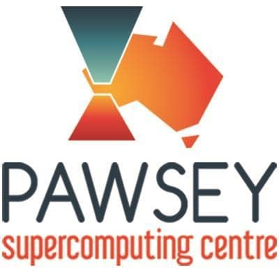

# Using Containers to Accelerate HPC

View this on [GitHub Pages](https://supercontainers.github.io/sc20-tutorial/).

## ECP Supercontainers Tutorial Session

## Details

Half-day Tutorial Session

Venue: Supercomputing Conference 2020 (SC20')

Date: Tuesday, 10 November 2020 2:30pm - 6:30pm (Eastern Standard Time)

Location: Virtual (Atlanta, GA, USA)

Link: [Container Computing for HPC and Scientific Workflows @ SC20](https://sc20.supercomputing.org/presentation/?id=tut129&sess=sess271)

Topic Area: Programming Models & Systems Software

Keywords: Containerized HPC, System Software and Runtime Systems, Scientific Software Development, DevOps

## EC2 Login

These will be provided the day of the tutorial.

## Abstract

Container computing has revolutionized the way applications are developed and delivered. It offers opportunities that never existed before for significantly improving efficiency of scientific workflows and easily moving these workflows from the laptop to the supercomputer. Tools like Docker, Shifter, Singularity and Charliecloud enable a new paradigm for scientific and technical computing. However, to fully unlock its potential, users and administrators need to understand how to utilize these new approaches. This tutorial will introduce attendees to the basics of creating container images, explain best practices, and cover more advanced topics such as creating images to be run on HPC platforms using various container runtimes. The tutorial will also explain how research scientists can utilize container-based computing to accelerate their research and how these tools can boost the impact of their research by enabling better reproducibility and sharing of their scientific process without compromising security. 

This is an updated version of the highly successful tutorial presented at SC16, SC17, SC18 and SC19.

## Prerequisites

This is a hands-on tutorial. Participants should bring a laptop and load or pre-install a terminal and/or ssh client in advance to make best use of time during the tutorial.  We will be providing training user accounts to both pre-configured EC2 instances.

This tutorial is supported by the Amazon AWS Machine Learning Research Awards. EC2 images and temporary login credentials will be distributed onsite at the tutorial.

After the tutorial, you can boot our tutorial image yourself on Amazon EC2 to run through the tutorial again. We recommend you use your own EC2 key and change the password.

US-West-Oregon: ami-0fe12765123c6a840 

### Optional Prerequisites

Users can also install Docker and Singularity prior to attending the tutorial session. Here, it may be beneficial to create a docker and sylabs (singularity) account in advance at https://cloud.docker.com/ and https://cloud.sylabs.io/ This accounts will be needed to create images on docker cloud/dockerhub and sylabs cloud.

[Install Singularity on Linux](https://sylabs.io/guides/3.3/user-guide/)

[Install Singualrity on Mac](https://repo.sylabs.io/desktop/) (Alpha)

[Install Docker for Desktop](https://www.docker.com/products/docker-desktop)

## Questions

You can ask questions verbally or with this [Google Doc](https://docs.google.com/document/d/11gMZ-T7iA5XiRWPLYIqX7Gqv7RMb-NF9kzGYHrnOi04/edit?usp=sharing).
Please append your question below the others in the document.

We have also created a Slack Team for this.  The invitation link is [here](https://join.slack.com/t/hpc-containers/shared_invite/enQtODI3NzY1NDU4OTk5LTUxOTgyOWJmYjIwOWI5YWU2MzBhZDI3Zjc1YmZmMjAxZjgzYzk4ZWEwNmFlNzlkOWI0MGNlZDNlMTBhYTBlOWY).

## Schedule

14:30 - 14:45 Introduction to containers in HPC (Shane)  
Including defining jargon (containers, images, registries/repos,..)  

14:45 - 15:25 Build and run your first Docker container (Shane)  
Including also minimal pull and run examples, to define these concepts  

15:25 - 15:40 BREAK

15:40 - 16:15 Deploy containers on a supercomputer (Marco)  

16:15 - 16:40 High-performance containers (Marco)  

16:40 - 16:55 BREAK

16:55 - 17:15 Best practices (Shane)  

17:15 - 17:35 E4S containers initiative (Sameer)  

17:35 - 17:55 Advanced container builds (Eduardo)  

17:55 - 18:00 Wrap-up and final Q&A  

<!--
13:30 – 13:45 [Introduction to Containers in HPC](slides/sc19_tutorial_intro.pdf) (Younge)  
13:45 – 14:15 [How to build your first Docker container](/01-hands-on.md) (Canon)  
14:15 – 14:45 [How to deploy a container on a supercomputer](/02-hands-on.md) (Canon)  
14:45 – 15:00 [Best Practices](slides/sc19_tutorial_bestpract.pdf) (Canon)  
15:00 – 15:30              - Break –  
15:30 – 16:00 [Running an HPC app on the E4S container](slides/E4S_SC19.pdf) (Shende)  
16:00 - 16:30 [How to build a Singularity container image](/03-hands-on.md) (Arango)  
16:30 - 16:50 [Running Singularity on a supercomputer & adv features](/04-hands-on.md) (Arango)  
16:50 - 17:00 [Success Stories & Summary](slides/sc19_tut_summary.pdf) (Canon)  
-->

