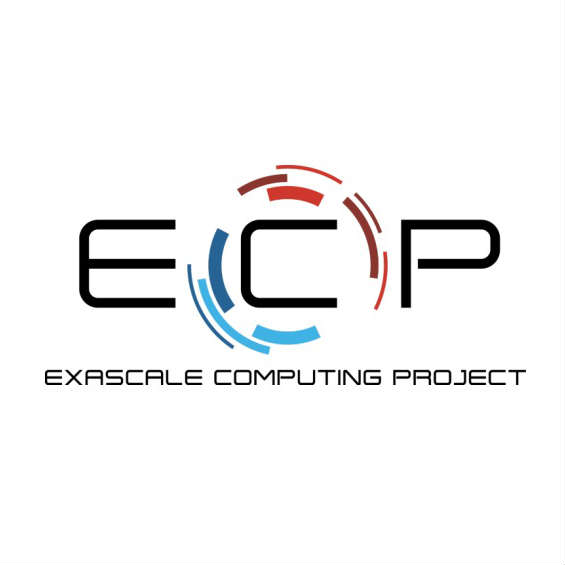

# Getting Started with Containers on HPC

## ECP Supercontainers Tutorial Session

## Details

Half-day Tutorial Session

Venue: International Supercomputing Conference 2019 (ISC19')

Date: June 16th, 2019

Room: Monte Rosa 1,2

Location: Frankfurt, DE

Link: [Getting Started with Containers on HPC @ ISC19](https://2019.isc-program.com/presentation/?id=tut148&sess=sess127)

Topic Area: Programming Models & Systems Software

Keywords: Containerized HPC, System Software and Runtime Systems, Scientific Software Development, DevOps

## Abstract

Within just the past few years, the use of containers has revolutionized the way in which industries and enterprises have developed and deployed computational software and distributed systems. The containerization model is gaining traction within the HPC community as well with the promise of improved reliability, reproducibility, and levels customization that are not otherwise possible on supercomputers previously. From the onset of containerization in HPC, Singularity has lead the way in providing container services, ranging from small clusters to entire supercomputers.

This hands-on tutorial looks to train users on the usability of containers on HPC resources. Specifically, the tutorial will walk through the processes of creating, deploying, and running Singularity containers on a Linux cluster. We will provide a detailed background on Linux containers, along with introductory hands-on experience building and running containers on a cluster. Furthermore, the tutorial will provide more advanced information on how to run MPI-based HPC applications as well as cutting-edge machine learning frameworks. Users will leave the tutorial with a solid foundational understanding of how to utilize containers with HPC resources through Singularity, as well as an in-depth knowledge to deploy custom containers on their own resources.

## Prerequisites

This is a hands-on tutorial. Participants should bring a laptop and load or pre-install a terminal and/or ssh client in advance to make best use of time during the tutorial.  We will be providing test user accounts to both pre-configured EC2 instances as well as the Cori Supercomputer at NERSC.

This tutorial is supported by the Amazon AWS Machine Learning Research Awards. EC2 images and temporary login credentials will be distributed onsite at the tutorial.

### Optional Prerequisites

Users can also install Docker and Singularity prior to attending the tutorial session. Here, it may be beneficial to create a docker account in advance at https://cloud.docker.com/. This account will be needed to create images on docker cloud and dockerhub.

[Install Singularity on Linux](https://www.sylabs.io/guides/3.2/user-guide/quick_start.html#quick-installation-steps)

[Install Singualrity on Mac](https://repo.sylabs.io/desktop/) (Alpha)

[Install Docker for Desktop](https://www.docker.com/products/docker-desktop)

## Schedule

14:01 - 14:30 [Introduction to Containers in HPC](slides/isc19_intro_to_containers_ajy.pptx) (Younge)

14:30 - 15:00 [How to build your first Docker container](/01-hands-on.md) (Canon)

15:00 - 15:30 [How to deploy a container on a supercomputer with Shifter](/02-hands-on.md)(Canon)

15:30 - 16:00 -- Break --

16:00 - 16:30 [How to build a Singularity container image](/03-hands-on.mdd)(Arango)

16:30 - 17:00 [Running Singularity on a supercomputer and advanced features](/04-hands-on.md)(Arango)

17:00 - 17:30 [Example: Running an HPC app on the E4S container](slides/E4S_PROTEAS_AHM_Mar19.pptx) (Shende)

17:30 - 18:00 Success Stories and Summary (Canon)
